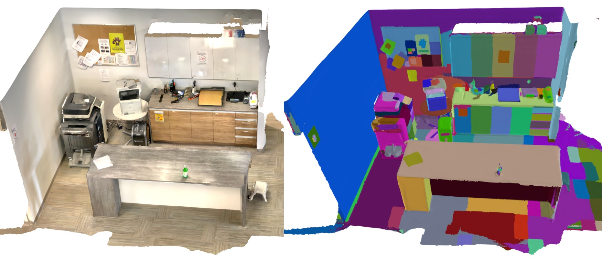

# SegmentAnyScene

Segment-Anything on 3D scenes meshes. This project is still on its early stage, I will keep updating it with more features and better documentation.



Watch the video of the entire segmentation progress on [YouTube](https://youtu.be/gdlwxsa9-6I).

## Introduction

Segment Any Scene extends the capabilities of the Segment Anything Model, originally designed for 2D images, to work with 3D scene meshes.

The method can be summarized as:

1. Rasterize the mesh triangles into each frame, assigning triangle face indices to frames.
2. Create a list of trackers, one for each triangle, with attributes for voting.
3. Update the trackers using SAM masks and triangle indices.
4. Find the most common object ID within each mask, avoiding duplicates.
5. Assign new object IDs if no previous ID is available for a mask.
6. Incrementally update the voting system as new frames are processed.

In short, it is a voting system where each triangle in the mesh is voted by SAM masks, ensuring object IDs are assigned and updated across frames.

### TODO
- [ ] Add more description about the details of the implementation

## Installation

1. Create a new conda environment and activate it.
    ```bash
    conda create -n samscene python=3.10 -y
    conda activate samscene
    ```

2. Install [Semantic-SAM](https://github.com/UX-Decoder/Semantic-SAM) by following their instructions [here](https://github.com/UX-Decoder/Semantic-SAM?tab=readme-ov-file#unicorn-getting-started).
    ```bash
    pip3 install torch==1.13.1 torchvision==0.14.1 --extra-index-url https://download.pytorch.org/whl/cu113
    pip install 'git+https://github.com/MaureenZOU/detectron2-xyz.git'
    pip install git+https://github.com/cocodataset/panopticapi.git
    pip install git+https://github.com/UX-Decoder/Semantic-SAM.git
    ```

    *Note*: you may encounter error like below when running `import semantic_sam`:
    ```bash
    ModuleNotFoundError: No module named 'MultiScaleDeformableAttention'
    ```
    You can compile `MultiScaleDeformableAttention` CUDA op with the following commands:
    ```bash
    git clone git@github.com:facebookresearch/Mask2Former.git
    cd Mask2Former/mask2former/modeling/pixel_decoder/ops
    sh make.sh
    ```

3. Install [PyTorch3D](https://github.com/facebookresearch/pytorch3d), please refer to their [installation guide](https://github.com/facebookresearch/pytorch3d/blob/main/INSTALL.md) for more details.
    ```bash
    pip install "git+https://github.com/facebookresearch/pytorch3d.git"
    ```

4. Install this package.
    ```bash
    pip install -e .
    ```

### TODO
- [ ] add a standalone semantic-sam inference package for easier installation
- [ ] add a installation script for easier installation all packages


## Dataset

Download multiscan example dataset from [HuggingFace](https://huggingface.co/datasets/ysmao/multiscan_example).
```bash
huggingface-cli download --resume-download ysmao/multiscan_example --local-dir ./data/multiscan/scene_00021_00 --local-dir-use-symlinks False --repo-type dataset
```

For downloading the entire multiscan dataset, please refer to [Multiscan Dataset](https://github.com/smartscenes/multiscan?tab=readme-ov-file#multiscan-dataset).

### TODO
- [ ] Add support for ScanNet dataset
- [ ] Add support for Arbitrary 3D scene meshes with/without camera trajectories

## Demo

### Prepare the data
Decode the MultiScan example data from mp4 to images, and jsonl camera trajectories to json files.
```bash
python examples/prepare_dataset.py output=outputs
```
The output will be saved to `outputs/scene_00021_00` folder.

### Prepare the Semantic-Sam masks
Download the pre-trained Semantic-SAM model [here](https://github.com/UX-Decoder/Semantic-SAM/releases/tag/checkpoint) to `./models` folder.
```bash
python examples/prepare_segmentation.py
```
The output will be saved to `outputs/scene_00021_00/semantic_sam` folder.

*Note*: This step will take a while to run, about an hour for 1916 frames (~2 sec/frame) on my single GPU device, as SAM auto sample on the entire image will take quite some time. Will tryout some more efficient inference method in the future, such as the methods listed [here](https://github.com/IDEA-Research/Grounded-Segment-Anything/tree/main/EfficientSAM) or more recent [SAM2](https://github.com/facebookresearch/segment-anything-2).

### Run the 3D scene segmentation
```bash
python examples/prepare_masks3d.py
```
The output will be saved to `outputs/scene_00021_00/masks3d` folder, which includes:
- `face_to_object.npy`: the mapping from each face to the object ID.
- `colored_mesh.ply`: the colored mesh with object IDs.

## Related Work

Many thanks to the great works that lay the foundation of this project:

- [Semantic-SAM](https://github.com/UX-Decoder/Semantic-SAM)
- [Segment-Anything](https://github.com/facebookresearch/segment-anything)
- [PyTorch3D](https://github.com/facebookresearch/pytorch3d)

We also encourage readers to check another great work for 3D scene segmentation with 2D SAM masks:

- [SegmentAnything3D](https://github.com/Pointcept/SegmentAnything3D)

The main difference between this project and SegmentAnything3D is that we are working on 3D meshes, instead of working on point clouds, and we don't use the Felzenswalb and Huttenlocher's Graph Based Segmentation for post-processing.

## Citation

If you find this project useful for your research, please consider citing:
```
@Misc{mao2024samscene,
  title={SegmentAnyScene Github Page},
  author={Yongsen Mao and Manolis Savva},
  year={2024}
}
```